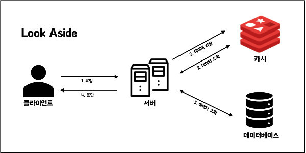
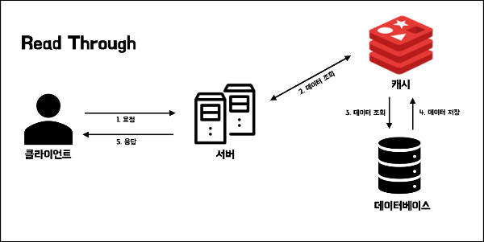
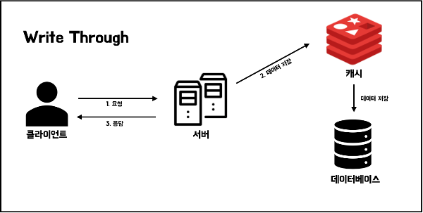
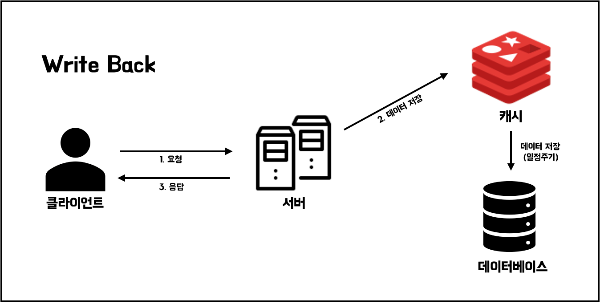
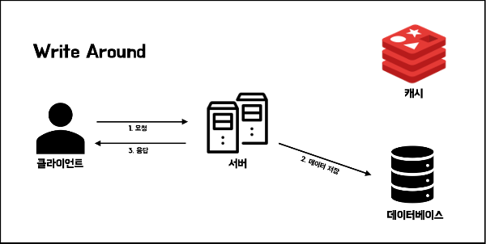

# 5장 레디스를 캐시로 사용하기
## 레디스 캐시
- 캐시란?
    - 데이터의 원본보다 더 빠르고 효율적으로 액세스할 수 있는 임시 데이터 저장소
    - 동일한 정보를 반복 가져온다면 캐시에서 데이터를 빠르게 가져옴으로써 리소스를 줄이고 속도를 향상한다.
- 애플리케이션이 다음 조건을 만족한다면 캐시 도입이 매우 효과적이다.
    - 원본 데이터 저장소에서 데이터를 검색하는 시간이 오래 걸리거나, 매번 계산이 필요한 경우
    - 캐시에서 가져오는 것이 원본 데이터 저장소보다 빨라야 한다.
    - 캐시에 저장된 데이터는 잘 변하지 않는, 갱신이 적은 데이터이다.
    - 캐시에 저장되는 데이터는 자주 검색되는 데이터이다.
- 캐시의 장점
    - 원본 데이터 저장소에서 데이터를 가져오는 속도를 줄이므로 애플리케이션 응답 속도를 줄인다.
    - 원본 데이터 저장소에서의 커넥션을 줄일 수 있다.
    - 원본에서 데이터를 가져올 때 CPU 와 메모리 등 리소스를 많이 사용했다면 그 리소스를 줄일 수 있다.
        - 같은 값을 도출하기 위해 반복 계산을 할 필요가 없기 때문이다.

___

### 캐시로서의 레디스 장점
- 단순 키-값 형태 저장이므로 데이터 저장 및 반환이 굉장히 간단하다.
- 자체적으로 다양한 자료 구조를 제공하므로 애플리케이션 단의 자료 구조를 그대로 사용하여 바로 저장한다. 
- 인메모리이므로 데이터 검색 및 반환이 상당히 빠르다. 평균 읽기 및 읽기가 1ms 미만
- 자체적으로 고가용성 기능을 가진다. (센티널 또는 클러스터 기능 사용, 자동 failover 복구)
- 확장성: 레디스 클러스터 사용 시 캐시의 스케일 아웃을 쉽게 할 수 있다. 


## 캐싱 전략
- 캐싱 전략에 따라 서비스 성능에 큰 영향을 끼칠 수 있다.
- 캐싱되는 데이터 유형과 액세스 패턴에 따라 적절한 캐싱 전략을 선택하는 것이 중요하다.

### 읽기 전략 - look aside
- cache aside 전략이라고도 한다.
- 애플리케이션에서 데이터를 읽을 때 주로 사용하는 전략으로, 일반적으로 캐시를 배치하는 방식이다. 
- 동작
    - 데이터가 먼저 캐시에 있는지를 확인한다. 
    - 캐시에 데이터가 있으면 캐시에서 데이터를 읽어온다. 이를 **캐시 히트** 라고 한다.
    - 데이터가 없으면 **캐시 미스**가 발생하며, 원본에서 가져와 캐시에 저장하고 응답한다.
- 장점
    - 레디스에 문제가 생겨 접근이 불가해도 장애로 이어지지 않을 수 있고 원본 저장소에서 가져올 수 있다. 
    - 즉, 캐시 장애 대비가 되어 있다.
- 단점
    - 기존에 데이터 조회가 아주 많았다면 모든 커넥션이 한꺼번에 원본 DB 로 몰려 부하 발생 가능성이 있다.
    - 이로 인해 원본 DB 의 응답이 느려지거나 리소스 소모 등 이슈로 성능 문제가 일어날 수도 있다. 
- 찾고자 하는 데이터가 레디스에 없을 때만 레디스에 데이터가 저장되므로 lazy loading 이라고도 한다.
- 만약, 처음 레디스가 도입되거나 원본 DB 에만 새로운 데이터를 넣는 경우 문제?
    - 처음엔 원본 DB 에만 데이터가 존재하여 매번 **캐시 미스**가 발생할 것이다.
    - 캐시 미스로 DB 접근 과정이 계속 일어나 오히려 지연이 초래돼 성능에 영향을 미칠 수 있다.
    - 이러한 문제를 해결할 수 있는 방법이 `캐시 워밍(cache warming)`이다.



`캐시 워밍`
- 미리 데이터베이스에서 캐시로 데이터를 밀어넣어주는 작업
- 새로운 데이터가 생겼을 때 원본 DB 와 같이 캐시에 미리 데이터를 넣어줘서 **캐시 미스**를 방지한다.

### 읽기 전략 - read through
- 캐시에서만 데이터를 읽어오는 방식
- look aside 와 비슷하나 데이터 동기화를 라이브버리 또는 캐시 제공자에게 위임한다는 점에서 차이가 있다.
    - 즉, 앱은 캐시에만 요청하고 캐시 미스 처리는 캐시가 담당한다는 것
    - 직접적인 DB 접근을 최소화하고 read 에 소모되는 자원을 최소화할 수 있다.
- **캐시와 DB 간 데이터 동기화가 항상 이루어져 정합성 문제에서 벗어날 수 있다.**
    - DB 에서 데이터를 읽어온 후 캐시에도 즉시 업데이트
- 하지만, 데이터 조회를 전적으로 캐시에만 의지하므로, redis 가 다운되면 서비스에 차질이 있을 수 있다.
    - 따라서 replication 또는 클러스터로 구성하여 가용성을 높이는 것이 중요하다.
- 여기서도 '캐시 워밍' 방식을 수행하는 것이 좋다.


___


### 쓰기 전략과 캐시 일관성
- 캐시는 원본 DB 에 있는 데이터의 복제본과 같다.
- 따라서 원본 데이터와 동일하도록 유지하는 것이 필수적이다.
- 만약 데이터가 변경될 때 원본 DB 에만 업데이트되고 캐시엔 반영되지 않는다면 **캐시 불일치** 문제가 발생한다.
    - 이 경우 데이터를 캐시에서 먼저 찾는 경우엔 잘못된 값을 반환하게 된다.
- 쓰기 전략에는 3가지가 있다. 
    - write through
    - cache invalidation
    - write behind(write back)

### 1. write through
- 원본 DB 에 데이터 업데이트마다 매번 캐시도 업데이트시키는 방식
- 따라서 캐시도 매번 최신 데이터 상태를 가지고 있다는 장점이 있다.
- 하지만, 매번 2개의 저장소에 같이 저장되므로 시간이 더욱 소요되는 단점이 있다.
- 또한, 다시 사용되지 않을 수 있는 모든 데이터를 캐시에 저장한다. 
    - 캐시엔 다시 사용될 수 있는, 자주 사용되는 데이터가 저장되는 것이 좋다.
    - 따라서 일종의 리소스 낭비가 일어날 수 있는 것이다.
    - 이 경우엔 반드시 만료 시간을 지정해야 한다.



### 2. cache invalidation
- 원본 DB 에 값을 업데이트할 때마다 캐시에는 데이터를 삭제하는 방식
- 저장소에서 특정 데이터 삭제 작업이 새로운 데이터 저장 작업보단 훨씬 리소스를 적게 사용한다.
- 캐시 데이터가 삭제되면 이후엔 원본 DB 에서 데이터를 가져오고 저장하므로 데이터 불일치 문제는 없다.

### 3. write behind(write back)
- 쓰기가 빈번하게 일어나는 서비스라면 write behind 방식을 고려하는 것이 좋다. 
- **데이터를 빠르게 접근 가능한 캐시에 업데이트하고, 건수나 특정 주기에 따라 비동기적으로 DB 에 반영하는 방식이다.** 
- 매번 쓰기마다 DB 에 대량의 쓰기 작업이 발생할 때 디스크 IO 를 많이 유발해 성능 저하가 발생하는 문제를 없애기 위함이다.
- 저장되는 데이터가 실시간으로 정확한 데이터가 아니어도 되는 경우 유용하다.
    - ex. 유투브같은 스트리밍 사이트의 좋아요 수는 매번 실시간 집계가 중요하진 않다.
    - 따라서 일단 캐시에 저장하고 5분 간격으로 좋아요를 원본에 반영하는 것이다.
    - 하지만 캐시 데이터가 날아갈 수 있는 위험을 인지해야 한다.



### 4. write around 
- write through 보다 훨씬 빠르다. 
- 모든 데이터를 캐시를 갱신하지 않고 DB 에만 저장하는 방식이다.
- cache miss 가 발생하는 경우에만 DB 와 캐시에도 데이터를 같이 저장한다.
- **cache miss 발생 전에 데이터가 수정되면 캐시와 DB 내의 데이터 불일치가 일어날 수 있다.**
- 따라서 데이터가 한번 쓰여진 후 덜 자주 읽히거나 읽지 않는 상황에서 좋은 성능을 제공한다.



___

### 캐시 읽기와 쓰기 전략의 조합
- look aside + write around 조합
    - 가장 일반적으로 자주 쓰이는 조합이다. 
    - 읽기: 캐시에 데이터가 있다면 읽고, 없다면 DB 에서 읽는다. **이때 캐시는 업데이트하지 않는다.**
    - 쓰기: 캐시는 건너뛰고 DB 에만 저장한다.
    - 데이터가 자주 조회되나 쓰기 빈도는 낮은 시스템이나, 주요 데이터만 캐시에 저장하고 싶은 경우 사용
- read through + write around 조합
    - 읽기: 캐시에 데이터가 있으면 읽고, 캐시에 없으면 DB 에서 조회한 후 캐시에도 업데이트
    - 쓰기: 캐시를 건너뛰고 DB 에만 저장한다.
    - cache hit 는 높을 수 있으나 데이터를 쓴 후 즉시 읽으면 cache miss 가 일어날 수 있음
    - 읽기가 매우 빈번하고, 쓰기 후 즉시 데이터가 읽히지 않아도 괜찮은 경우 사용
- read through + write through 조합
    - 읽기: 캐시에 데이터가 있으면 읽고, 캐시에 없으면 DB 에서 조회한 후 캐시에도 업데이트
    - 쓰기: 캐시와 원본 DB 에 동시 저장
    - 캐시와 DB 간의 데이터 정합성 이슈에 대해 완벽하다. 항상 최신 데이터 유지
    - 하지만 쓰기 시 캐시에도 업데이트되어 오버헤드가 발생
    - 쓰기 작업 후 꼭 최신 데이터가 필요하거나, 데이터 일관성이 중요할 때 사용, ex. 계좌 잔액 정보 등


## 캐시에서의 데이터 흐름
- 캐시는 자주 사용할 만한 데이터를 가져와서 임시로 저장해놓는 저장소다.
- 레디스는 인메모리로 기본적으로 메모리는 서버의 스토리지보다 훨씬 적은 양을 저장한다.
- 따라서 캐시 메모리가 가득차지 않도록 일정 양의 데이터 유지할 수 있어야 한다.
    - 즉, 메모리 공간을 관리하여 새로운 데이터는 추가되고, 기존 오래된 데이터는 삭제될 수 있어야 한다.
    - 따라서 적절한 TTL 지정이 필수이다.

### 만료 시간 
- 만료 시간 지정은 데이터 수명을 관리하여 메모리 공간을 효율적으로 사용할 수 있도록 한다.
- TTL (Time To Live) 은 데이터가 얼마나 오래 저장될 것인지를 의미
- 레디스는 특정 키에 대한 만료 시간 TTL 지정이 가능하여, 지정된 시간이 지나면 키-값이 자동 삭제된다.
    - 만료 시간은 일반적으로 초 단위로 표현된다.    
- 커맨드
    - `EXPIRE` : 키에 대한 만료 시간 설정
    - `TTL` : 남은 만료 시간 확인, 만료 시간이 지정되어 있지 않으면 -2 반환
    - PEXPIRE, PTTL 은 ms 단위로 동작
- 주의할 것은 기존 키에 새로운 값을 저장해 키를 덮어쓰는 경우엔 이전에 설정한 TTL 은 **사라진다.**

### 키가 만료될 때 삭제되는 방식, passive vs active 
- 키가 만료되어도 바로 메모리에서 삭제되는 것은 아니다.
- 키는 passive 방식과 active 방식 두 가지로 삭제된다.
- `passive 방식`
    - 클라이언트가 키에 접근하고자 할때 키가 만료되었다면 메모리에서 수동적으로 삭제한다.
    - 사용자가 접근할 때만 삭제되므로 passive 방식이라고 한다.
    - 하지만 사용자가 만료된 키에 다시 접근하지 않을 수 있으므로 충분하지 않다.
- `active 방식`
    - TTL 값이 있는 키 중 20개를 랜덤 추출하여 만료된 키를 모두 메모리에서 삭제한다.
    - 20개 중. 만약 25% 이상의 키가 삭제된다면 다시 20개의 키를 랜덤하게 뽑아 확인하고,
    - 20개 중 25% 이상의 키가 삭제되지 않으면 뽑아놓은 20개의 키 집합에서 다시 만료시간을 확인한다.
    - 이러한 과정을 1초에 10번씩 수행한다.
- 만료된 키를 곧바로 삭제하지 않으므로 키를 삭제하는 데 들어가는 리소스를 줄일 수 있다.
- 하지만, 만료된 키를 바로 삭제하지 않으므로 그만큼 메모리를 더 소모하고, 최악의 경우 전체 1/4 가 이미 만료된 키일 수 있다.

___

### 메모리 관리와 maxmemory-policy 설정
- TTL 로 키 관리를 하더라도 메모리는 제한적이므로 너무 많은 키가 저장되면 여전히 가득 차는 상황이 발생한다.
- 따라서 **메모리의 용량을 초과하는 양의 데이터가 저장되면 내부 정책을 사용해 어떤 키를 삭제할 지 결정할 수 있다.**
- maxmemory: 데이터의 최대 저장 용량 설정
- maxmemory-policy: 최대 용량을 초과할 때의 처리 방식 설정

`Noeviction`
- 기본값 설정
- 레디스에 데이터가 꽉 차도 임의로 데이터를 삭제하지 않고 더 이상 저장할 수 없다는 에러를 반환한다.
- 에러가 발생할 경우 로직에 따라선 장애로 이어질 수도 있고, 애플리케이션 단에서 관리자가 직접 데이터를 삭제해주어야 한다.
- 보통 데이터가 가득 차도 캐시 내부 판단으로 삭제하는 것이 위험하다고 생각될 때 사용할 수 있다.
- 하지만, 직접 관리가 필요하여 권장되진 않는 설정이다.

`LRU eviction`
- LRU(Least Recently Used), 말그대로 가장 오랫동안 사용되지 않은 키 삭제이다. 
- 최근 액세스되지 않은 것은 나중에도 액세스 가능성이 낮다는 가정을 전제한다.
- 캐시는 나중에 사용될 데이터를 저장하는 것이 목표이므로 합리적인 관리 방법이다.
- **volatile-lru:**  
    - 만료 시간이 설정되어 있는 키에 한해서 LRU 를 적용해 키를 자동 삭제한다. 
    - 만약 임의적 방식으로 자동 삭제되면 안되는 키엔 만료 시간을 지정하지 않는다면 이 방식이 적합하다.
    - 하지만 장애 상황 가능성이 있다. 만약, 모두 만료 시간이 지정되어 있지 않으면 noeviction 과 같다.
    - 삭제할 수 있는 키가 하나도 없다면 레디스에 더 이상 데이터를 저장할 수 없어 에러를 반환한다.
- **allkeys-lru:**
    - 레디스를 잘 모른다면 allkeys-lru 방식이 권장된다.
    - 이것은 모든 키에 대해 LRU 를 적용하여 데이터를 삭제한다.
    - 따라서 메모리에 꽉 찼을 때 장애가 발생할 상황은 방지할 수 있다.

`LFU eviction`
- LFU (Least Frequently Used), 가장 자주 사용되지 않은 데이터를 삭제하는 방식
- LFU 는 LRU 와는 유사하나 키를 액세스하는 패턴에 따라 우선순위가 유동적으로 바뀐다는 점에서 더 효율적일 수 있다.
    - 즉, 키가 오랫동안 사용되지 않아도 과거에 자주 액세스했다면 놔둔다. 
    - 자주 사용된 데이터는 나중에라도 자주 사용될 데이터가 될 수 있다는 가정을 전제하기 때문
- **volatile-lfu:**
    - 만료 시간이 설정된 키에 한해서 LFU 로 삭제
    - volatile-lru 처럼 만료 시간이 지정된 키가 거의 없다면 장애 가능성이 있다.
- **allkeys-lfu:**
    - 모든 키에 대해 LFU 를 이용해 데이터 삭제

**LRU/LFU 알고리즘은 모두 근사 알고리즘으로 동작한다.**
- 정확하게 그 조건에 맞는 키를 찾아내는 것이 불필요하게 CPU 및 메모리 자원을 소비할 수 있기 때문이다.
- 따라서 정확한 키를 찾아내 삭제하는 것이 목적이 아니다.
- noeviction 정책을 제외하고 저장된 데이터는 특정 상황에 모두 삭제될 수 있다는 가정 하에 동작한다.
- 정확한 키를 계산하는거보다 특정 키를 근사치로 찾아내 효율적으로 삭제하는 것을 목표로 작동한다.

`RANDOM eviction`
- 저장된 키 중 하나를 임의로 골라 삭제
- 어떠한 알고리즘을 사용하지 않으므로 삭제될 키 값을 계산하지 않아도 되므로 레디스 부하를 줄일 수 있다.
- 하지만 랜덤 삭제이므로 나중에 사용될 수 있는 데이터를 삭제할 가능성이 높다.
- 앞서 LRU/LFU 는 근사치를 계산하므로 큰 리소스가 들지 않아 부하를 줄일 목적으로 사용하는 것은 권장하지 않는다.
- volatile-random, allkeys-random 설정 두 방식이 있다.

`volatile-ttl`
- TTL 이 가장 짧은, 즉 삭제 예정 시간이 얼마 남지 않은 키를 추출해 미리 삭제하는 방식이다.
- LRU/LFU 와 같이 근사 알고리즘을 사용한다.
- 따라서 저장된 키를 모두 스캔하면서 비교하지 않으므로 간단하게 키를 찾아낼 수 있다.
    - 내부적으로 몇개 샘플링하여 그 중 남은 TTL 이 가장 작은 키를 제거
- 만료 시간이 지정된 키만 대상으로 하면 noeviction 과 같은 상황이 일어날 수 있다.

___

### 캐시 스탬피드 현상
- 대규모 트래픽 환경에서 '만료 시간을 어떻게 설정하느냐'에 따라 캐시 스탬피드와 같은 문제가 발생할 수 있다.
- 만약 look aside 전략으로 읽기 조회하는 경우
    - 여러 애플리케이션 서버에서 찾은 키가 만료된 키라면?
    - 서버1에서도 원본에서 찾아 캐시에 저장, 서버2에서도 원본에서 찾아 저장
    - 즉, 여러 서버가 한꺼번에 DB 에서 읽어오는 중복 읽기와 캐시에 저장하는 중복 쓰기가 발생한다.
    - 만약, 무거운 쿼리 작업이라면 중복 읽기 작업은 DB 에 부하를 줄 수 있고 서비스 이슈로도 이어질 수 있다.
- 즉, 캐시 스탬피드 현상은 핫 키가 만료됨으로 인해 다수의 요청이 동시에 캐시 미스가 나 중복 읽기/쓰기가 발생하면서 트래픽이 증가하는 현상이다.
- 한번 캐시 스탬피드 현상이 발생하면 연쇄적으로 이 현상에 영향을 받게 되어 **계단식 실패** 라고도 부른다.

이 캐시 스탬피드 현상을 줄이기 위한 방법을 알아보자


`적절한 만료 시간 설정`
- 캐시 스탬피드를 줄이기 위한 가장 간단한 방법은 TTL 을 너무 짧지 않게 하는 것이다.
- 여러 애플리케이션에서 접근하고 반복 사용되는 데이터라면 충분히 길게 주는 것이 적합하다.


`선 계산`
- look aside 라면 먼저 캐시에 데이터가 있는 지 확인 후, 없다면 원본 DB 에 접근할 것이다.
- 여기서 캐시 스탬피드가 문제되는 지점은?
    - 만료되었을 때 동시다발로 여러 서버에서 이를 인지하고, 이후 작업을 실행하기 때문
- 따라서 키가 실제로 만료되기 전에 값을 미리 갱신해주어 해결할 수 있다.
    - 기존: TTL 시간이 지나 만료되면 데이터를 원본 DB 에서 가져와 갱신
    - 변경 후: 랜덤한 확률로 키가 만료되기 전 데이터를 미리 원본 DB 에서 가져와 갱신 (즉, TTL 도 갱신)
```python
def fetch(key, expiry_gap):
    ttl = redis.ttl(key)
    
    if ttl - (random() * expiry_gap) > 0:
        return redis.get(key)
    
    else:
        value = db.fetch(key)
        redis.set(value, KEY_TTL)
        return value

# Usage
fetch('hello', 2)
```
- 이때 expiry_gap 값을 적절히 설정해주는 것이 중요하다. 
    - 너무 크다면 불필요한 갱신이 많아지고, 너무 작으면 갱신 타이밍을 놓치게 된다.


`PER 알고리즘`
- PER(Probabilistic Early Recomputation), 확률적 조기 재계산 알고리즘
- 캐시 값이 만료되기 전에 언제 DB 에 접근하여 값을 읽어오면 되는지를 최적으로 계산할 수 있다.
```
currentTime - ( timeToCompute * beta * log(rand())) > expiry
```
- currentTime: 현재 남은 만료 시간
- timeToCompute: 캐시된 값을 다시 재계산하는 데 걸리는 시간
- beta: 기본적으로 1.0보다 큰 값으로 설정 가능
- rand(): 0과 1 사이 랜덤 값 반환
- expiry: 키를 재설정할 때 새로 넣어줄 만료 시간
    - 만약 앞 계산된 값이 expiry 보다 크다면 거짓, 작다면 참(true)가 된다.
    - 만료 시간이 가까워질수록, 즉 currentTime 이 작을수록 true 가 될 확률이 높아진다.
    - true 라면 다시 데이터를 저장소에서 읽어 재계산한다.
- **즉, PER 은 만료 시간이 가까워질수록 더 높은 확률로 재계산하도록 설계되었다.**
    - 따라서 단순 GET 사용보다 이 함수를 적용하여 데이터를 가져오도록 하면 캐시 스탬피드를 줄여 최적화할 수 있다.


